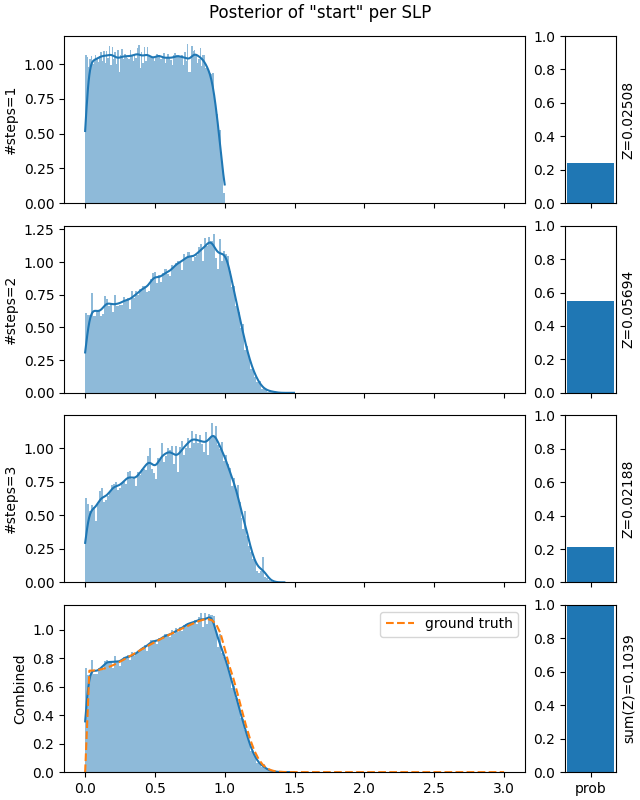
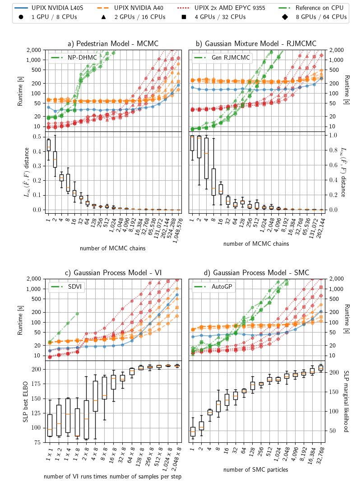

# UPIX: Universal Programmable Inference in JAX

... brings back stochastic control flow to probabilistic modelling in JAX.

:warning: **This is research work in progress.** :construction:

**Universal probabilistic programming languages (PPL)** like Pyro or Gen enable the user to specify models with **stochastic support**.
This means that control flow and array shapes are allowed to depend on the values sampled during execution.
This is **fundamentally incompatible with JIT-compilation in JAX**.
Thus, probabilistic programming systems built on top of JAX like NumPyro are restricted to models with static support, i.e. they disallow Python control flow.
UPIX realises the **Divide-Conquer-Combine (DCC)** approach [1] as a framework which brings back JIT-compilation for universal PPLs.

At its core the DCC approach splits up a model with stochastic support into a potentially infinite number of sub-models with static support.
In UPIX this is realised with a custom JAX interpreter which records and compiles the probabilistic program for *each* choice of branching decisions (all instances where an abstract JAX array tracer is made concrete).
Thus, a program specified in our universal PPL is split up into multiple JIT-compilable **straigt-line-programs (SLPs)**.

UPIX provides constructs to for **programmable inference**: we enable the user to customise 
- how the model is split up in the *divide step*
- how the inference is run in the *conquer step*
- how the approximations of the sub-models are *combined*

## Usage

This is a work in progress. Instructions are coming soon.

Install options: `[cpu]`, `[cuda]`, and `[tpu]`.

For now, we refer to the example programs in the `evaluation` folder.

We recommend using [uv](https://github.com/astral-sh/uv) with `uv run -p python3.13 --frozen --extra=cuda script_to_run.py`.

## Example
```python
import jax
from upix.core import *

@model
def pedestrian():
    start = sample("start", dist.Uniform(0.,3.))
    position = start
    distance = 0.
    t = 0
    while (position > 0) & (distance < 10):
        t += 1
        step = sample(f"step_{t}", dist.Uniform(-1.,1.))
        position += step
        distance += jax.lax.abs(step)
    sample("obs", dist.Normal(distance, 0.1), observed=1.1)
    return start
```
Above we have implemented the Pedestrian model from Mak et al. [2].
The syntax resemples NumPyro with the criticial difference that the while loop depends on `position` and `distance`, two quantities that are computed from the random variables `f"step_{t}"`.
Thus, the number of while loop iteration depends on the values sampled during execution, resulting in a stochastic support.
Each straight-line program SLP corresponds to a sub-model where the loop is run for a fixed number of times.

```python
class DCCConfig(MCMCDCC[T]):
    def get_MCMC_inference_regime(self, slp: SLP) -> MCMCRegime:
        regime = MCMCSteps(
            MCMCStep(Variables("start"), RW(lambda x: dist.Uniform(jnp.zeros_like(x),3))),
            MCMCStep(Variables(r"step_\d+"), DHMC(50, 0.05, 0.15)),
        )
    def initialise_active_slps(self, active_slps: List[SLP], inactive_slps: List[SLP], rng_key: jax.Array):
        ...
    def update_active_slps(self, active_slps: List[SLP], inactive_slps: List[SLP], rng_key: PRNGKey):
        ...

dcc_obj = DCCConfig(m, verbose=2,
    parallelisation=get_parallelisation_config(args),
    init_n_samples=250,
    init_estimate_weight_n_samples=2**20,
    mcmc_n_chains=8,
    mcmc_n_samples_per_chain=25_000,
    estimate_weight_n_samples=2**23,
    max_iterations=1,
)

result = dcc_obj.run(jax.random.key(0))

plot_histogram_by_slp(result, "start")
```


<br>

Above, we sketch a MCMC-DCC inference algorithm for the Pedestrian model.
In `get_MCMC_inference_regime`, we customise the MCMC kernel used for each SLP.
We use a Metropolis-Hastings kernel `RW` for the `start` variable, which simply proposed a uniform value from 0 to 3.
For the step variables, we apply discontinuous HMC `DHMC`, a variant of Hamiltonian Monte Carlo which can deal with discontinuities.

In `initialise_active_slps` and `update_active_slps`, we may specify how we find SLPs and for which of them inference should be run.
In the former, we simply draw 250 samples from the program prior which instantiates SLPs, then weigh them with importance sampling, and make the most probable SLPs active.
For this simple model, in `update_active_slps` we simply make all SLPs inactive after running inference once.
For more complex model, we may implement more sophisticated routines here that discard low probability SLPs and slighlty mutate high probability SLPs resulting in multiple DCC phases.

Lastly, building on features of JAX, we allow the user to customise parallelisation and vectorisation for inference.
In UPIX, you can run inference for multiple SLPs in parallel on multi-core CPUs or on different accelerator devices like GPUs or TPUs.
But we also have the option to use mutliple devices to accelerate inference for a single SLP.
This is especially useful for inference routines which can be efficiently parallelised like many-chain MCMC, multiple-run VI, or SMC, see the scaling section below.

On the right, you can see the inference result as an approximation to the posterior of the variable `start`.
We have histograms for each SLP, i.e. for each number of steps / loop iteration.
On the right of the historgrams you can see the weight that was estimated for each SLP.
Combining the samples according to those weights results in the historgram on the bottom which approximates the posterior of start in the full model with stochastic support.
We can see that this approximation is close to the ground truth.

<br clear="right"/>

## Implemented DCC algorithms

- Markov-Chain-Monte-Carlo DCC. See the [pedestrian example](evaluation/pedestrian).
- Variational Inference DCC (SDVI [3]). See the [Gaussian process example](evaluation/gp/gp_vi.py).
- Reversible Jump / Involutive MCMC DCC. See the [Gaussian mixture model example](evaluation/gmm).
- Sequential Monte Carlo DCC. See the [Gaussian process example](evaluation/gp/gp_smc.py).
- Variable Elimination DCC. See the [Urn example](evaluation/urn).

## Scaling Inference on multiple XLA devices



## References
[1] Zhou, Yuan, et al. "Divide, conquer, and combine: a new inference strategy for probabilistic programs with stochastic support." International Conference on Machine Learning. PMLR, 2020.

[2] Mak, Carol, Fabian Zaiser, and Luke Ong. "Nonparametric hamiltonian monte carlo." International Conference on Machine Learning. PMLR, 2021.

[3] Reichelt, Tim, Luke Ong, and Thomas Rainforth. "Rethinking variational inference for probabilistic programs with stochastic support." Advances in Neural Information Processing Systems 35 (2022): 15160-15175.