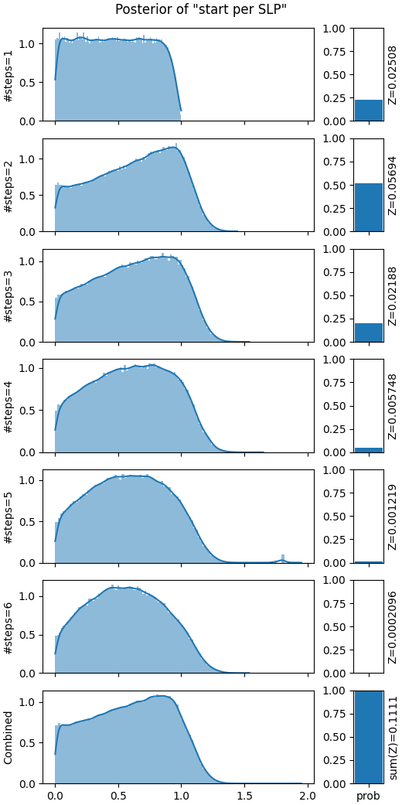

# UPIX: Universal Programmable Inference in JAX

... brings back stochastic control flow to probabilistic modelling in JAX.

**Universal probabilistic programming languages (PPL)** like Pyro or Gen enable the user to specify models with **stochastic support**.
This means that control flow and array shapes are allowed to depend on the values sampled during execution.
This is **fundamentally incompatible with JIT-compilation in JAX**.
Thus, probabilistic programming systems built on top of JAX like Numpyro are restricted to models with static support, i.e. they disallow Python control flow.
UPIX realises the **Divide-Conquer-Combine (DCC)** approach as a framework which brings back JIT-compilation for universal PPLs.

At its core the DCC approach splits up a model with stochastic support into a potentially infinite number of sub-models with static support.
In UPIX this is realised with a custom JAX interpreter which records and compiles the probabilistic program for *each* choice of branching decisions (all instances where an abstract JAX array tracer is made concrete).
Thus, a program specified in our universal PPL is split up into multiple JIT-compilable **straigt-line-programs (SLPs)**.

UPIX provides constructs to for **programmable inference**: we enable the user to customise 
- how the model is split up in the *divide step*
- how the inference is run in the *conquer step*
- how the approximations of the sub-models are *combined*

## Usage


This is a work in progress. Instructions are coming soon.

Install options: `[cpu]`, `[gpu]`, and `[tpu]`.

For now, we refer to the example programs in the `evalutation` folder.

## Example
```python
import jax
from upix.core import *

@model
def pedestrian():
    start = sample("start", dist.Uniform(0.,3.))
    position = start
    distance = 0.
    t = 0
    while (position > 0) & (distance < 10):
        t += 1
        step = sample(f"step_{t}", dist.Uniform(-1.,1.))
        position += step
        distance += jax.lax.abs(step)
    sample("obs", dist.Normal(distance, 0.1), observed=1.1)
    return start
    
class DCCConfig(MCMCDCC[T]):
    def get_MCMC_inference_regime(self, slp: SLP) -> MCMCRegime:
        regime = MCMCStep(AllVariables(), DHMC(50, 0.05, 0.15))
        return regime
    def initialise_active_slps(self, active_slps: List[SLP], inactive_slps: List[SLP], rng_key: jax.Array):
        ...
    def update_active_slps(self, active_slps: List[SLP], inactive_slps: List[SLP], rng_key: PRNGKey):
        ...

dcc_obj = DCCConfig(m, verbose=2,
    parallelisation=get_parallelisation_config(args),
    init_n_samples=250,
    init_estimate_weight_n_samples=2**20,
    mcmc_n_chains=8,
    mcmc_n_samples_per_chain=25_000,
    estimate_weight_n_samples=2**23,
    max_iterations=1,
)

result = dcc_obj.run(jax.random.key(0))
```

Lorem ipsum dolor sit amet, consectetur adipiscing elit, sed do eiusmod tempor incididunt ut labore et dolore magna aliqua. Ut enim ad minim veniam, quis nostrud exercitation ullamco laboris nisi ut aliquip ex ea commodo consequat. Duis aute irure dolor in reprehenderit in voluptate velit esse cillum dolore eu fugiat nulla pariatur. Excepteur sint occaecat cupidatat non proident, sunt in culpa qui officia deserunt mollit anim id est laborum.



