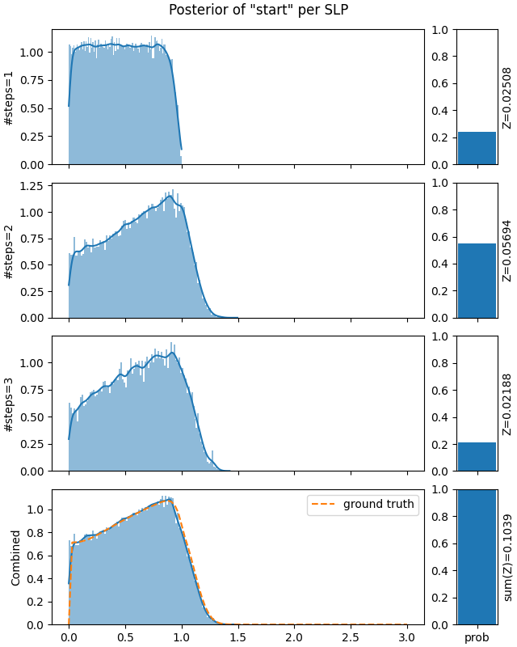
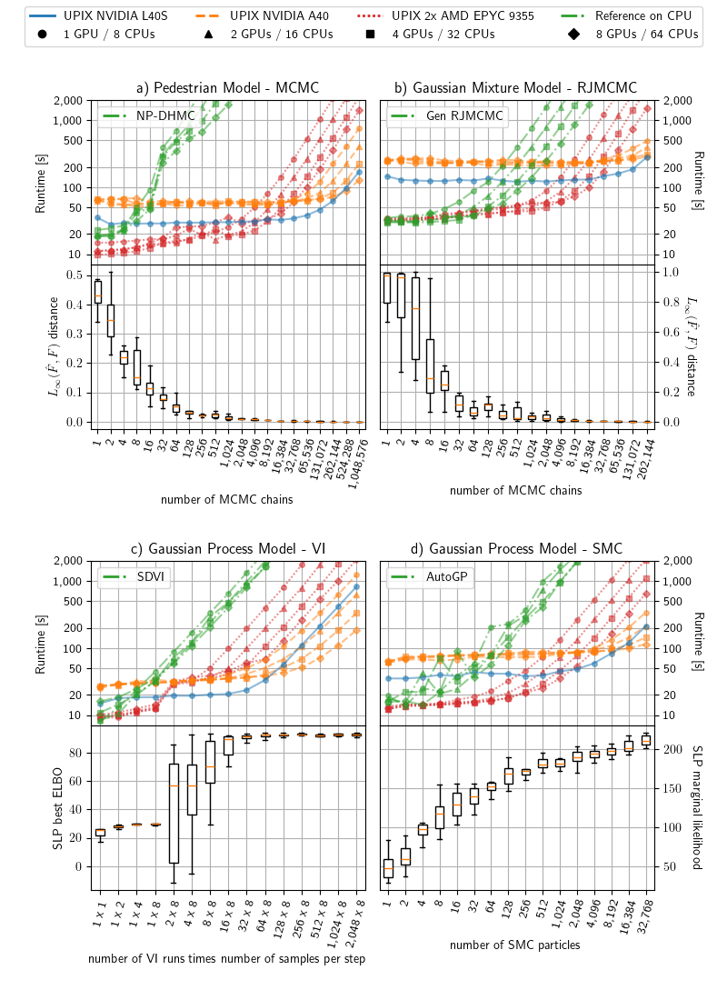

# UPIX: Universal Programmable Inference in JAX

... brings back stochastic control flow to probabilistic modelling in JAX.

**Universal probabilistic programming languages (PPL)** like Pyro or Gen enable the user to specify models with **stochastic support**.
This means that control flow and array shapes are allowed to depend on the values sampled during execution.
This is **fundamentally incompatible with JIT-compilation in JAX**.
Thus, probabilistic programming systems built on top of JAX like NumPyro are restricted to models with static support, i.e. they disallow Python control flow.
UPIX realises the **Divide-Conquer-Combine (DCC)** approach [1] as a framework which brings back JIT-compilation for universal PPLs and enables running inference on CPUs, GPUs or TPUs.

At its core the DCC approach splits up a model with stochastic support into a potentially infinite number of sub-models with static support.
In UPIX this is realised with a custom JAX interpreter which records and compiles the probabilistic program for *each* choice of branching decisions (all instances where an abstract JAX array tracer is made concrete).
Thus, a program specified in our universal PPL is split up into multiple JIT-compilable **straigt-line-programs (SLPs)**.

UPIX provides constructs to for **programmable inference**: we enable the user to customise 
- how the model is split up in the *divide step*
- how the inference is run in the *conquer step*
- how the approximations of the sub-models are *combined*

## Usage

This is a work in progress. Instructions are coming soon.

Install options: `[cpu]`, `[cuda]`, and `[tpu]`.

For now, we refer to the example programs in the `evaluation` folder.

We recommend using [uv](https://github.com/astral-sh/uv) with `uv run -p python3.13 --frozen --extra=cuda script_to_run.py`.

## Example
```python
import jax
from upix.core import *

@model
def pedestrian():
    start = sample("start", dist.Uniform(0.,3.))
    position = start
    distance = 0.
    t = 0
    while (position > 0) & (distance < 10):
        t += 1
        step = sample(f"step_{t}", dist.Uniform(-1.,1.))
        position += step
        distance += jax.lax.abs(step)
    sample("obs", dist.Normal(distance, 0.1), observed=1.1)
    return start
```
Above we have implemented the Pedestrian model from Mak et al. [2].
The syntax resemples NumPyro with the criticial difference that the while loop depends on `position` and `distance`, two quantities that are computed from the random variables `f"step_{t}"`.
Thus, the number of while loop iteration depends on the values sampled during execution, resulting in a stochastic support.
Each straight-line program SLP corresponds to a sub-model where the loop is run for a fixed number of times.

```python
class DCCConfig(MCMCDCC[T]):
    def get_MCMC_inference_regime(self, slp: SLP) -> MCMCRegime:
        regime = MCMCSteps(
            MCMCStep(Variables("start"), RW(lambda x: dist.Uniform(jnp.zeros_like(x),3))),
            MCMCStep(Variables(r"step_\d+"), DHMC(50, 0.05, 0.15)),
        )
    def initialise_active_slps(self, active_slps: List[SLP], inactive_slps: List[SLP], rng_key: jax.Array):
        ...
    def update_active_slps(self, active_slps: List[SLP], inactive_slps: List[SLP], rng_key: PRNGKey):
        ...

dcc_obj = DCCConfig(m, verbose=2,
    parallelisation=get_parallelisation_config(args),
    init_n_samples=250,
    init_estimate_weight_n_samples=2**20,
    mcmc_n_chains=8,
    mcmc_n_samples_per_chain=25_000,
    estimate_weight_n_samples=2**23,
    max_iterations=1,
)

result = dcc_obj.run(jax.random.key(0))

plot_histogram_by_slp(result, "start")
```


<br>

Above, we sketch a MCMC-DCC inference algorithm for the Pedestrian model.
In `get_MCMC_inference_regime`, we customise the MCMC kernel used for each SLP.
We use a Metropolis-Hastings kernel `RW` for the `start` variable, which simply proposed a uniform value from 0 to 3.
For the step variables, we apply discontinuous HMC `DHMC`, a variant of Hamiltonian Monte Carlo which can deal with discontinuities.

In `initialise_active_slps` and `update_active_slps`, we may specify how we find SLPs and for which of them inference should be run.
In the former, we simply draw 250 samples from the program prior which instantiates SLPs, then weigh them with importance sampling, and make the most probable SLPs active.
For this simple model, in `update_active_slps` we simply make all SLPs inactive after running inference once.
For more complex model, we may implement more sophisticated routines here that discard low probability SLPs and slighlty mutate high probability SLPs resulting in multiple DCC phases.

Lastly, building on features of JAX, we allow the user to customise parallelisation and vectorisation for inference.
In UPIX, you can run inference for multiple SLPs in parallel on multi-core CPUs or on different accelerator devices like GPUs or TPUs.
But we also have the option to use mutliple devices to accelerate inference for a single SLP.
This is especially useful for inference routines which can be efficiently parallelised like many-chain MCMC, multiple-run VI, or SMC, see the scaling section below.

On the right, you can see the inference result as an approximation to the posterior of the variable `start`.
We have histograms for each SLP, i.e. for each number of steps / loop iteration.
On the right of the historgrams you can see the weight that was estimated for each SLP.
Combining the samples according to those weights results in the historgram on the bottom which approximates the posterior of start in the full model with stochastic support.
We can see that this approximation is close to the ground truth.

<br clear="right"/>

## Implemented DCC algorithms

- Markov-Chain-Monte-Carlo DCC. See the [pedestrian example](evaluation/pedestrian).
- Variational Inference DCC (SDVI [3]). See the [Gaussian process example](evaluation/gp/gp_vi.py).
- Reversible Jump / Involutive MCMC DCC. See the [Gaussian mixture model example](evaluation/gmm).
- Sequential Monte Carlo DCC. See the [Gaussian process example](evaluation/gp/gp_smc.py).
- Variable Elimination DCC. See the [Urn example](evaluation/urn).

## Scaling Inference on multiple XLA devices



## References
[1] Zhou, Yuan, et al. "Divide, conquer, and combine: a new inference strategy for probabilistic programs with stochastic support." International Conference on Machine Learning. PMLR, 2020.

[2] Mak, Carol, Fabian Zaiser, and Luke Ong. "Nonparametric hamiltonian monte carlo." International Conference on Machine Learning. PMLR, 2021.

[3] Reichelt, Tim, Luke Ong, and Thomas Rainforth. "Rethinking variational inference for probabilistic programs with stochastic support." Advances in Neural Information Processing Systems 35 (2022): 15160-15175.

### Installation (Kick-the-tires instructions)

#### Hardware Requirements

- For reproducing Section 4
  - MacOS / Linux
  - >= 8 CPU cores
  - >= 32 GB RAM
  - 5 - 6 hours runtime
- For reproducing Section 5 fully
  - Linux
  - 64 CPU cores
  - 8 Nvidia GPUs with 48 GB VRAM
  - ~100 hours runtime
- For reproducing Section 5 partially
  - Linux
  - 8 CPU cores
  - 1 Nvidia GPU
  - ~10 hours runtime

#### Docker (Recommended)

Install [docker](https://www.docker.com).

You can download and load the docker image provided at [Zenodo](TODO) with
```
docker load -i upix-amd64.tar
``` 
or
```
docker load -i upix-arm64.tar
```
depending on your system, which was saved with (Docker version 28.3.0)
```
docker buildx build --platform linux/amd64 -t upix-amd64 .
docker buildx build --platform linux/arm64 -t upix-arm64 .
docker image save upix-amd64 > upix-amd64.tar
docker image save upix-arm64 > upix-arm64.tar
```
Run those images with
```
mkdir -p experiments/data
docker run -it -v $(pwd)/experiments/data:/experiments/data --shm-size=2g --name upix-amd64 --rm upix-amd64
```
or
```
mkdir -p experiments/data
docker run -it -v $(pwd)/experiments/data:/experiments/data --shm-size=2g --name upix-arm64 --rm upix-arm64
```


Alternatively, build the upix image from scratch (this may take several minutes):
```
docker build -t upix .
```

If the build was successful, run the docker image:
```
mkdir -p experiments/data
docker run -it --rm -v $(pwd)/experiments/data:/experiments/data --shm-size=2g --name upix --rm upix
```

Make sure to make all CPUs and RAM available in the container.  
To make GPUs in the container available, see https://docs.docker.com/engine/containers/gpu/.
Runtimes using the docker container may be different compared to running locally.

The installation of the `sholtzen/dice` image is also required.
```
docker pull sholtzen/dice@sha256:5aadf3edfa7aea292492b14971d9ac03adef1ddc7548e65d011ddc1e6969fa2e
```

#### Manual

To run the experiments on your machine you need uv, Julia 1.9, and [docker](https://www.docker.com).  
If you want to run experiments on Nvidia GPU, you need CUDA (used version: 13.2).

Install [uv](https://github.com/astral-sh/uv), e.g. with `curl -LsSf https://astral.sh/uv/install.sh | sh`.

Install [julia 1.9](), e.g. with `curl -fsSL https://install.julialang.org | sh -s -- --yes --default-channel=1.9`.

```
uv sync -p python3.13 --frozen --extra=cpu
mkdir -p $(pwd)/tmp
export TMPDIR=$(pwd)/tmp
export PYTHON=$(pwd)/.venv/bin/python3
julia --project=evaluation/gmm/gen -e "import Pkg; Pkg.instantiate()"
julia --project=evaluation/gp/autogp -e "import Pkg; Pkg.instantiate()"
docker pull sholtzen/dice@sha256:5aadf3edfa7aea292492b14971d9ac03adef1ddc7548e65d011ddc1e6969fa2e
```

#### Sanity Check

Make sure `export TMPDIR=$(pwd)/tmp` is set.

Run inside Docker container (if used) with `<ncpu>` set to the number of available CPU cores in your machine, runtime ~10min:
```
python3 experiments/runners/run_comp.py all <ncpu> --smoketest
```
Run outside of Docker container, runtime ~20s if dice image installed:
```
python3 experiments/runners/run_comp.py dice 1 --smoketest
```

For reference output see [sanity_check.txt](sanity_check.txt).

Outputs are stored in `experiments/data`.

To test execution with GPU, run
```
uv run -p python3.13 --frozen --extra=cuda evaluation/pedestrian/run_comp.py sequential pmap
```
which should list your GPU devices at the beginning, e.g.
```
Start DCC:
parallelisation=Sequential(global vmap, device=cuda:0)
...
```
and exit without error.

Delete the data folder after completing the sanity check:
```
rm -rf experiments/data
```

### Reproducing Section 4: DCC instantiations

Run following commands from the *root directory* to reproduce all experiments from Section 4.  
Output will be stored in `experiments/data`. **Delete this folder beforehand if it exists already, otherwise the analysis scripts may break.**

Experiments were run on a M2 Pro Macbook with ncpu=10 (without Docker).

Run inside Docker container (if used), runtime ~4h:
```
python3 experiments/runners/run_comp.py all <ncpu>
```
Run outside of Docker container, runtime ~2h:
```
python3 experiments/runners/run_comp.py dice 1
```
Set `<ncpu>` to the number of available CPU cores in your machine. The script will adjust the workload based on the available cores (see below).   
If you do not want use all your available CPU cores, for a fair benchmark, you need to limit them with `taskset` (only avaiable on Linux) or in the Docker settings.  
E.g. `taskset -c 0-3 python3 experiments/runners/run_comp.py all 4`.  
Otherwise, JAX, PyTorch, BLAS, etc will use all the available CPUs under the hood.  
The script will error if the number of available CPUs exceeds `<ncpu>`. You can silence this error by setting `export NOCHECKENV=true`.

The experiment results from the paper are included in the artifact.

Use `uv run --with=pandas experiments/table_1.py experiments/data` to print statistics as in Table 1.

In the following, the individual commands executed with `run_comp.py` are listed.  
For these commands we use the `NCPU` environment variable

#### Section 4.1: MCMC - Pedestrian Model

Run NP-DHMC baseline (with `$NCPU` parallel processes for `$NCPU` chains)
```
uv run -p python3.10 --no-project --with-requirements=evaluation/pedestrian/nonparametric-hmc/requirements.txt evaluation/pedestrian/nonparametric-hmc/pedestrian.py NP-DHMC $NCPU 1000 100 -n_processes $NCPU -seed 0
```

Run UPIX-MCMC-DCC (with `$NCPU` CPU devices for `$NCPU` chains)

```
uv run -p python3.13 --frozen --extra=cpu evaluation/pedestrian/run_comp.py sequential pmap -n_chains $NCPU -n_samples_per_chain 25000 --cpu -host_device_count $NCPU -seed 0
```

#### Section 4.2: SDVI - Gaussian Process Model

Run SDVI baseline (original implementation by Reichelt et al. 2022, with `$NCPU` parallel processes)
```
bash evaluation/gp/sdvi/run_comp.sh $NCPU 0 1000000 false
```

Run UPIX-SDVI (with `$NCPU` parallel processes)
```
uv run -p python3.13 --frozen --extra=cpu --with pandas evaluation/gp/run_comp_vi.py cpu_multiprocess vmap_local -sh_iterations 1000000 --cpu -num_workers $NCPU -seed 0
```

#### Section 4.3: RJMCMC - Gaussian Mixture Model
If you do not use the docker image, install the julia packages
```
julia --project=evaluation/gmm/gen -e "import Pkg; Pkg.instantiate()"
```

Run RJMCMC Gen baseline (with `$NCPU` processes for `$NCPU` chains)
```
julia -p $NCPU --project=evaluation/gmm/gen evaluation/gmm/gen/gmm.jl $NCPU 25000 0 comp
```

Run UPIX-RJMCMC-DCC (with `$NCPU` cpu devices for `$NCPU` chains)
```
uv run -p python3.13 --frozen --extra=cpu evaluation/gmm/run_comp.py sequential pmap -n_chains $NCPU -n_samples_per_chain 25000 --cpu -host_device_count $NCPU -seed 0
```


#### Section 4.4: SMC - Gaussian Process Model

If you do not use the docker image, install the julia packages
```
julia --project=evaluation/gp/autogp -e "import Pkg; Pkg.instantiate()"
```
Run AutoGP baseline (with `$NCPU` threads and `$NCPU * 10` particles)
```
julia -t $NCPU --project=evaluation/gp/autogp evaluation/gp/autogp/main.jl $((NCPU * 10)) false 0 false
```


Run UPIX-SMC-DCC (with `$NCPU` cpu devices and `$NCPU * 10` particles)
```
uv run -p python3.13 --frozen --extra=cpu --with=pandas evaluation/gp/run_comp_smc.py sequential smap_local -n_particles $((NCPU * 10)) --cpu -host_device_count $NCPU -seed 0
```


#### Section 4.5: VE - Urn Model

Run the Dice baseline with its [docker image](https://hub.docker.com/layers/sholtzen/dice/latest/images/sha256-5aadf3edfa7aea292492b14971d9ac03adef1ddc7548e65d011ddc1e6969fa2e) (on the M2 Pro this image performed better than a local install)
```
uv run evaluation/urn/dice/run.py 19
```

Run UPIX-VE-DCC
```
uv run -p python3.13 --frozen --extra=cpu --with=pandas evaluation/urn/run_comp.py sequential vmap_local 20 --cpu --jit_inf
```

### Reproducing Section 5: Scaling Experiments

We have implemented scripts to launch the scaling experiments for each model with varying hardware and workload.
Set `$platform = cpu | cuda` arguments depending on your hardware.
`$ndevices` **has to be a power of 2**.
If you do not have a CPU with a processor count that is a power of 2, then you may prefix the following commands with `taskset` to restrict the available CPUs, e.g. `taskset -c 0-7 python3 experiments/...` to use 8 CPUs (only works on Linux) or limit them in the Docker settings.
We ran our experiments on a Linux machine with 64 CPU cores and 8 48GB NVIDIDA GPUs (without Docker) using following configurations:
```
($platform, $ndevices) =
    (cpu, 8) | (cpu, 16) | (cpu, 32) | (cpu, 64) |
    (cuda, 1) | (cuda, 2) | (cuda, 4) | (cuda, 8)
```

The script arguments following `$platform, $ndevices` set the workload range for each of the four scaling experiments in log2 base.

For instance
```
python3 experiments/runners/run_pedestrian_scale.py cuda 1 0 20 sequential
```
runs the scaling experiment for the Pedestrian model with number of MCMC chains varying from `2^0=1` to `2^20=1048576` on a single GPU.

```
bash experiments/runners/run_scale_all_references.sh <ncpu> <logsuffix> 20 14 15 18
```
```
bash experiments/runners/run_scale_all_upix.sh cpu <ncpu> <logsuffix> 20 14 15 18
```
```
bash experiments/runners/run_scale_all_upix.sh cuda <ncuda> <logsuffix> 20 14 15 18
```
```
bash experiments/runners/run_scale_all_accuracy.sh 20 14 15 18
```


For convience
```
bash experiments/runners/run_scale_all_experiments.sh <ncpu> <ncuda> 10 10 10 10
```